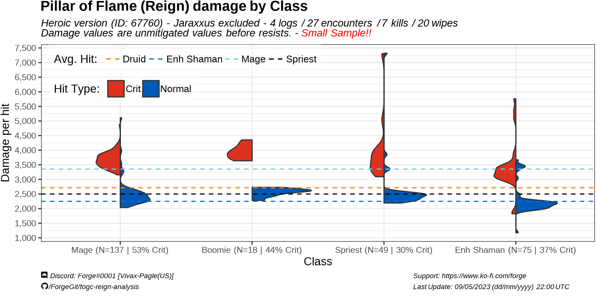
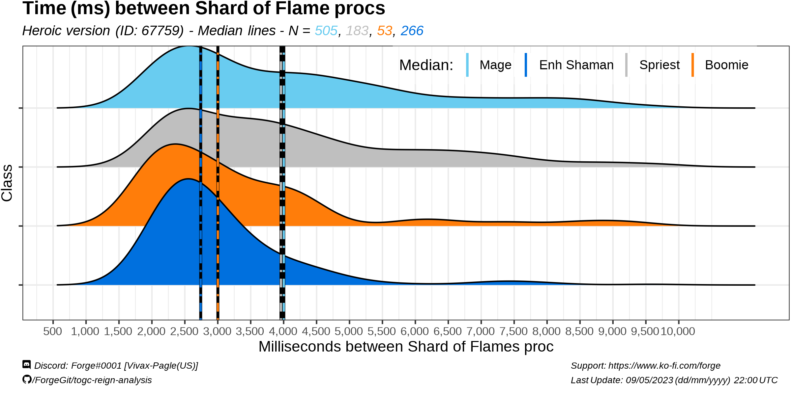

# Reign of the Unliving / Dead

2,015 PTR logs for the first session of TOGC PTR (May 5th - May 8th), only 4 PUBLIC logs had the trinket Reign (Heroic):

- 'tDzK7FTJqW3LwAr4' ~ 'Enh Shaman'
- '36XxM8WBTjFtcpKN' ~ 'Spriest'
- 'j2MkDALRFGr8cw9g' ~ 'Boomie'
- 'D3zVab78GpJ2dXM4' ~ 'Mage'

From this 4 logs, we can obtain the damage values for each Pillar of Flame hit (unmitigated value, before resist) and divide it by type of hit (Normal or Critical).

In the graphic we can see the mage had on average higher damage dealt per cast of Pillar of Flame (~3,300), while also having relatively higher crit chance (53%) compared to the other classes.

This is strictly a damage per hit comparison, and doesn't consider the # of casts/minute, i.e. procs of the trinket.
Estimating casts/minute also requires taking into consideration RP times, player deaths, wheter it was a wipe or a kill.

An alternative to this measure is how often each class takes to get one proc of the trinket (Shard of Flame).

The enh shaman had reign procs every 2.7s vs other classes at 3s (boomie), and 4s (mage/spriest) 

i.e.
Shaman had lower damage per hit, but it had more procs.
Mage had higher damage per hit, but it had less procs.

# Limitations

- Only 1 character per class (need more data to reach any conclusion).
- Not every class had full buffs.
- Not every class was playing optimally (PTR session).